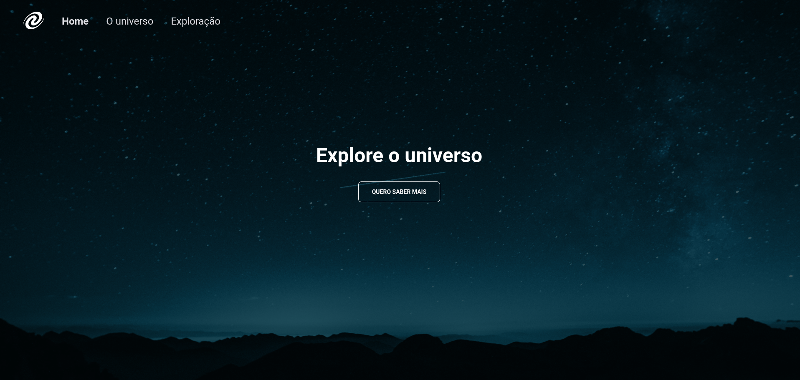

<h1 align="center">
	SPA Universe
</h1>

<h3 align="center">
	Project based on SPA application
</h3>

<p align="center">
  
</p>

## About

This project is designed to apply practical skills in JavaScript, HTML, and CSS by developing a webpage based on the Single Page Application (SPA) model. In this model, content updates occur on the same page without reloading a new one. 


## To run it

```shell
npm i && npm start

